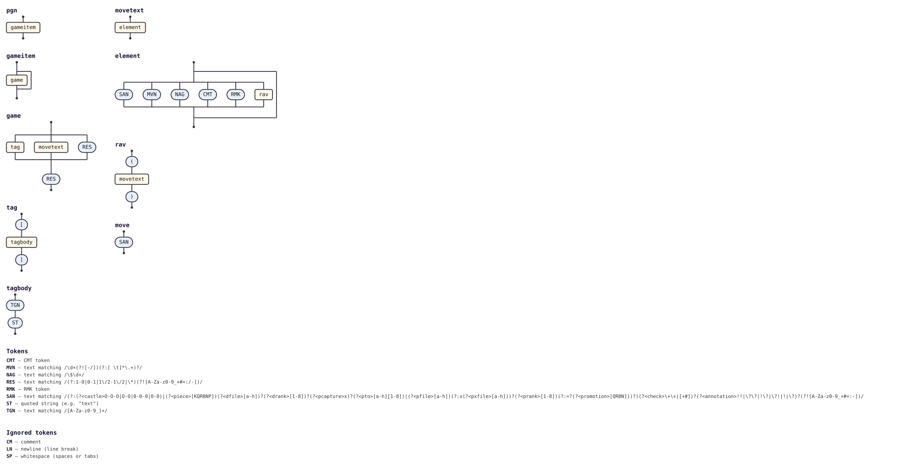

# @tabnas/chess

<!-- tabnas-badges -->
[](https://www.npmjs.com/package/@tabnas/chess)
[](https://github.com/tabnas/chess/actions/workflows/ci.yml)
[](https://pkg.go.dev/github.com/tabnas/chess/go)
[](https://tabnas.github.io/status/)
<!-- /tabnas-badges -->

A grammar plugin that teaches the [Tabnas](https://github.com/tabnas/parser)
parser to read **chess notation**: [PGN](https://www.chessprogramming.org/Portable_Game_Notation)
games and the [SAN](https://en.wikipedia.org/wiki/Algebraic_notation_(chess))
moves inside them. Available for both TypeScript and Go, built on the same
grammar.

Chess notation looks like this:

```pgn
[Event "F/S Return Match"]
[White "Fischer, Robert J."]
[Black "Spassky, Boris V."]
[Result "1/2-1/2"]

1. e4 e5 2. Nf3 {The main line.} Nc6 $1 (2... d6 3. d4) 3. Bb5 a6 1/2-1/2
```

## Install

```bash
# TypeScript / JavaScript
npm install @tabnas/parser @tabnas/chess

# Go
go get github.com/tabnas/chess/go@latest
```

## One tiny example

**TypeScript** — the plugin layers onto a Tabnas engine:

```js
const { Tabnas } = require('@tabnas/parser')
const { Chess } = require('@tabnas/chess')

const tn = new Tabnas().use(Chess)
const move = tn.parse('1. e4 e5 *')[0].moves[0]

move.san     // => 'e4'
move.piece   // => 'P'
move.to      // => 'e4'
move.number  // => 1
move.side    // => 'w'
```

There is a one-call entry point too, for when you do not need the engine:

```js
const { parseGame } = require('@tabnas/chess')

const capture = parseGame('1. e4 Nc6 2. d4 exd5 *').moves[3]

capture.san            // => 'exd5'
capture.piece          // => 'P'
capture.capture        // => true
capture.to             // => 'd5'
capture.disambiguation // => ({ file: 'e' })
```

**Go** — `chess.Parse` is the one-call entry point:

```go
import chess "github.com/tabnas/chess/go"

db, _ := chess.Parse("1. e4 e5 *")
// db[0].Moves[0] == &chess.Move{San: "e4", Piece: "P", To: "e4", Number: 1, Side: "w"}
```

## What you get back

A plain, JSON-serialisable game model — no classes, no cycles, nothing to
unwrap:

```js
const { parseGame } = require('@tabnas/chess')

const game = parseGame('[Event "Casual"]\n\n1. e4 {Best by test.} e5 (1... c5) 1-0')

game.tags.Event                          // => 'Casual'
game.result                              // => '1-0'
game.moves.length                        // => 2
game.moves[0].comments[0].text           // => 'Best by test.'
game.moves[1].variations[0].moves[0].san // => 'c5'
```

Each move is decomposed into the vocabulary the PGN standard itself uses —
piece, disambiguation, capture, destination, promotion, check indicator:

```js
const { parseSan } = require('@tabnas/chess')

const move = parseSan('Qa6xb7#')

move.piece          // => 'Q'
move.disambiguation // => ({ file: 'a', rank: 6 })
move.capture        // => true
move.to             // => 'b7'
move.check          // => '#'
```

**Every field is something the notation actually said.** This is a parser,
not a chess engine: it has no board, so it cannot tell you which knight
played `Nf3`, and it does not pretend to. `disambiguation` holds as much of
the origin square as was written, and nothing more.
[`ts/doc/concepts.md`](ts/doc/concepts.md) explains why the model is shaped
this way, and how it compares with the alternatives.

## Scope

`@tabnas/chess` implements the notation described by the
[PGN standard](https://www.chessprogramming.org/Portable_Game_Notation)
(Steven J. Edwards, 1994), section by section:

| Section | Feature | |
|---|---|---|
| 4, 7 | Character codes and token classes | ✅ |
| 5 | Brace `{…}` and rest-of-line `;…` commentary | ✅ kept, not discarded |
| 6 | The `%` escape mechanism (first column only) | ✅ |
| 8.1 | Tag pairs, with `\"` and `\\` string escapes | ✅ raw string values |
| 8.2.2 | Move number indications | ✅ counted where unwritten |
| 8.2.3 | SAN moves, in full | ✅ decomposed |
| 8.2.4 | Numeric annotation glyphs | ✅ |
| 8.2.5 | Recursive annotation variations | ✅ nested |
| 8.2.6 | Game termination markers | ✅ |
| 9.7 | The `FEN` tag, read for the starting move and side | ✅ |
| 18 | Databases: many games in one source | ✅ |
| 3 | Import format (lax) and export format (strict) | ✅ `strict` option |

Plus one thing the standard does not define: the `[%clk 0:05:00]` /
`[%eval …]` / `[%cal …]` markup that lichess, chess.com and ChessBase put
inside comments is parsed into `Comment.commands` (and the comment text is
still kept verbatim).

**Not included, deliberately:** move legality. Nothing here knows the rules
of chess, so `1. Qh8` parses happily and `1. e9` does not — the first is a
well-formed move, the second is not a move at all. Feed the output to a
board library if you need the difference. Also out of scope: FEN and EPD as
standalone documents (sections 16.1 and 16.2), and the non-standard `--`
null move and `(=)` draw offer some tools emit.

## A board to look at

[`web/`](web/) is a self-contained `<chess-game>` web component built on
this parser: a classic 2D board, controls to step through the game, and the
notation highlighted move by move.

```html
<script src="https://cdn.jsdelivr.net/npm/@tabnas/chess-game@0.1.0"></script>

<chess-game>1. e4 e5 2. Nf3 Nc6 3. Bb5 a6 1/2-1/2</chess-game>
```

One tag, no dependencies, no second request — or `npm install
@tabnas/chess-game` for a bundler, types included.


It is also where the parser's one hard limit becomes concrete. `Nf3` names
a piece and a destination, and a parser with no board cannot know *which*
knight — so the component supplies the missing half, a small legal move
generator that resolves each parsed move against the running position. See
[`web/README.md`](web/README.md).

## Documentation

Full documentation follows the [Diátaxis](https://diataxis.fr) framework —
one file per quadrant:

| | |
|---|---|
| **Tutorial** (learning) | [ts/doc/tutorial.md](ts/doc/tutorial.md) |
| **How-to guide** (tasks) | [ts/doc/guide.md](ts/doc/guide.md) |
| **Reference** (API + options + syntax) | [ts/doc/reference.md](ts/doc/reference.md) |
| **Concepts** (explanation) | [ts/doc/concepts.md](ts/doc/concepts.md) |

The docs' examples are TypeScript, but the model, the options and the
accepted notation are the same in both runtimes.

Package hubs: [`ts/README.md`](ts/README.md), [`go/README.md`](go/README.md).

## Grammar diagram

The grammar is defined once in the top-level
[`chess-grammar.jsonic`](chess-grammar.jsonic) and embedded into **both**
implementations — TypeScript ([`ts/src/chess.ts`](ts/src/chess.ts)) and Go
([`go/chess.go`](go/chess.go)) — by
[`ts/embed-grammar.js`](ts/embed-grammar.js) during the TypeScript build.
Edit the grammar there, not in the generated sources.

As a railroad/syntax diagram, generated from the live grammar with
[`@tabnas/railroad`](https://github.com/tabnas/railroad):



ASCII version: [`ts/doc/grammar.txt`](ts/doc/grammar.txt).

## License

MIT. Copyright (c) Richard Rodger.
