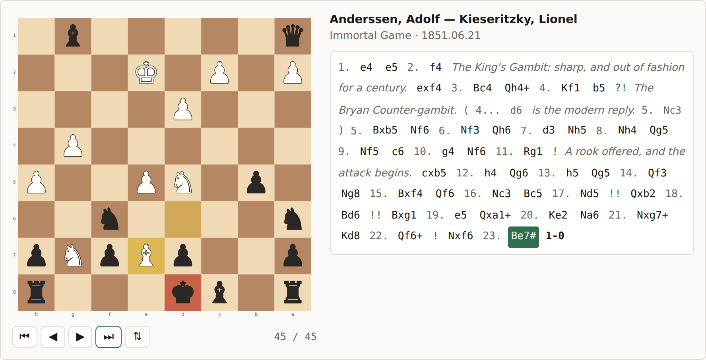

# &lt;chess-view&gt;

### 👉 [See it working — tabnas.github.io/chess](https://tabnas.github.io/chess/)

A self-contained web component that shows a PGN game as a classic 2D
chessboard, with controls to step through it and the notation highlighted
move by move.

```html
<script src="chess-view.js"></script>

<chess-view>1. e4 e5 2. Nf3 Nc6 3. Bb5 a6 1/2-1/2</chess-view>
```

The game is the element's **text content**. There is no configuration, no
JSON, and no second file: `@tabnas/chess` and the `@tabnas/parser` engine
are bundled in, the styles are inline, and the board is inline SVG.



## Install

### From a CDN

One tag, nothing to build:

```html
<script src="https://cdn.jsdelivr.net/npm/@tabnas/chess-view@0.1.3"></script>

<chess-view>1. e4 e5 2. Nf3 Nc6 3. Bb5 a6 1/2-1/2</chess-view>
```

[unpkg](https://unpkg.com) serves the same file from
`https://unpkg.com/@tabnas/chess-view@0.1.3`. Both resolve the bare
package URL to `dist/chess-view.js`, the minified IIFE build.

As a module, in a page or from an import map:

```html
<script type="module"
  src="https://cdn.jsdelivr.net/npm/@tabnas/chess-view@0.1.3/dist/chess-view.mjs"></script>
```

**Pin the version.** The examples above pin `@0.1.3`; the same URLs
without it follow the latest release, which is convenient right up until
it is not. And once pinned, a version is immutable on both CDNs, so it can
be checked:

```html
<script src="https://cdn.jsdelivr.net/npm/@tabnas/chess-view@0.1.3"
        integrity="sha384-…" crossorigin="anonymous"></script>
```

Each release ships the hashes of the files it published, so the value for
the version you pinned is at
`https://cdn.jsdelivr.net/npm/@tabnas/chess-view@0.1.3/dist/sri.json`.

### From npm

```bash
npm install @tabnas/chess-view
```

```js
import '@tabnas/chess-view'
```

The package has **no dependencies**: `@tabnas/chess` and the
`@tabnas/parser` engine are bundled in, and so are the TypeScript
declarations, so nothing else is installed to make either work.

Both module systems are covered — `require('@tabnas/chess-view')` and
`import '@tabnas/chess-view'` — and importing it on a server is safe:
nothing touches the DOM until the element is registered, and registration
is skipped where there is no custom element registry.

Importing registers `<chess-view>`. To register it under a different name,
import `define`:

```js
import { define } from '@tabnas/chess-view'
define('pgn-viewer')
```

### TypeScript

The declarations ship with the package, and are wired into the editor's
own model of HTML:

```ts
import '@tabnas/chess-view'

const board = document.querySelector('chess-view') // ChessViewElement
board?.goto(3)

document.addEventListener('chess-move', (e) => {
  e.detail.move?.san // string | undefined
})
```

`custom-elements.json` — a [custom elements
manifest](https://github.com/webcomponents/custom-elements-manifest) — is
published too, so editors that read it complete the tag, its attributes,
its CSS parts and its custom properties in plain HTML and CSS as well.

### Before it upgrades

The game is the element's text content, which means that until the
component is defined, the browser shows it: a line of PGN where the board
is going to be.

A classic `<script src>` in `<head>` blocks parsing, so the element is
defined before the board is even in the document and there is nothing to
see. A module script and a `defer`red one both run *after* the document
parses, so on those the raw notation is briefly on screen — measured on a
slow connection at a 17px line of text, jumping to a 453px board when the
bundle lands. One rule covers both the flash and most of the jump:

```css
chess-view:not(:defined) {
  display: block;
  visibility: hidden;
  min-height: var(--size, 24rem);
}
```

That hides the notation until the element exists and reserves the board's
height for it, which takes the shift from 436px to 69px — the controls
bar, which sits below the board and is not worth guessing the height of.

## Use

### Attributes

| Attribute | Values | Meaning |
|---|---|---|
| `orientation` | `white` (default), `black` | Which side is at the bottom. |
| `game` | a number | Which game of a multi-game database to show. Default `0`. |
| `ply` | a number | Which move to open at. `0` is the starting position. |
| `theme` | `auto` (default), `dark` | `auto` follows `prefers-color-scheme`. |
| `source` | `hidden` (default), `view`, `edit` | Show the notation itself, read-only or editable. |
| `commentary` | `inline` (default), `panel`, `hidden` | Where the annotator's prose goes. |
| `controls` | `visible` (default), `hidden` | The navigation button bar. |
| `notation` | `visible` (default), `hidden` | The whole side panel. |
| `tags` | `visible` (default), `hidden` | The players-and-event header. |
| `coordinates` | `visible` (default), `hidden` | The file and rank labels. |

The last four are subtractive: each takes a part of the UI away and the
rest closes up around it. With all of them `hidden` what is left is a
diagram — and the keyboard still works, because hiding the buttons hides
the buttons and nothing else.

```html
<chess-view notation="hidden" controls="hidden" coordinates="hidden" ply="33">
  1. e4 e5 2. Nf3 d6 3. d4 Bg4 …
</chess-view>
```

### Controls

Buttons for start / previous / next / end / flip, and the same from the
keyboard when the component has focus: <kbd>←</kbd> <kbd>→</kbd>
<kbd>Home</kbd> <kbd>End</kbd> <kbd>f</kbd>.

Clicking any move in the notation jumps to it — including a move inside a
variation, after which <kbd>←</kbd> and <kbd>→</kbd> walk **that**
variation. <kbd>Home</kbd> (or ⏮) returns to the game's start and to the
mainline.

### Events

Two, both bubbling: `chess-move` on every navigation, and `chess-source`
on every edit (see [above](#reading-and-editing-the-source)).

`chess-move` fires on every navigation, and bubbles:

```js
document.addEventListener('chess-move', (e) => {
  console.log(e.detail.ply, e.detail.move?.san)
})
```

`e.detail.move` is the parsed move from
[`@tabnas/chess`](../ts/doc/reference.md#move) — `san`, `piece`, `to`,
`disambiguation`, `capture`, `promotion`, `check`, `nags`, `comments` and
so on — or `undefined` at the starting position.

### Properties and methods

| | |
|---|---|
| `el.move` | The move currently shown, or `undefined`. |
| `el.ply` | How far into the current line the view is; `0` is the start. |
| `el.source` | The notation being shown. Settable; `undefined` restores the text content. |
| `el.goto(n)` | Show the `n`th move of the current line. |
| `el.load()` | Re-read the source. Called automatically on change. |

### Commentary

Comments, glyphs and variations all show. `commentary="inline"` puts the
prose among the moves, as an annotated game reads on paper;
`commentary="panel"` gives it a box of its own that follows the position,
which is better when there is a lot of it; `hidden` drops it.

**Is there an official grammar for commentary?** Partly, and it is worth
knowing which part:

| | |
|---|---|
| The two comment forms, `{…}` and `;…` | [PGN standard](https://www.chessprogramming.org/Portable_Game_Notation) §5, 1994 |
| Numeric annotation glyphs, `$1`–`$255` | PGN standard §10 |
| `[%name operand,operand]` inside a comment | [PGN Specification Supplement](https://www.ficsgames.org/pgnsupp.txt), final draft 2001 |
| `[%eval]`, `[%csl]`, `[%cal]` | nothing — de facto, from lichess and ChessBase |

The prose itself has no grammar at all: to the standard it is text, and
that is all it is here too.

The supplement — Cowderoy, Bulsink, Templeton, Bentzen, Feist and
Zakharov, 8 September 2001 — is the only specification for the `[%…]`
markup, and it defines exactly four commands: `clk`, `egt`, `emt` and
`mct`, all times. Everything else you see in the wild borrows its syntax
without being in it. So `@tabnas/chess` parses the *syntax* and interprets
none of the *names*, and this component displays the four the supplement
gives a meaning to, plus `eval`, as a small chip:

```
2. Nf3  0:02:57  0.21  Book.
```

The rest are dropped from the display and left in the parsed data. That is
the supplement's own instruction — "strip out all commands before display
in order to improve legibility" — and it matters more than it sounds:
without it, every move of a lichess export reads `{ [%clk 0:03:00] }`
where the annotation should be. `csl` and `cal` are drawing instructions
rather than words, so showing them as text would be worse than showing
nothing.

### Reading and editing the source

`source="view"` shows the notation the component is displaying;
`source="edit"` lets you type into it and re-parses as you go.

```html
<chess-view source="edit">1. d4 d5 2. c4 e6 *</chess-view>
```

Half-typed notation is the normal state of an editor, not a failure, so
the board **keeps its last good position** while you are mid-move and says
what is wrong underneath; it does not blank out and come back on every
keystroke. Your place in the game is kept too — add a move at the end and
the view stays where it was.

Edits do **not** write back to the element's text content: whatever put
the notation there — a template, a framework, a CMS — would only overwrite
them again. Instead the element reports each edit, and `el.source` is the
notation it is actually showing:

```js
board.addEventListener('chess-source', (e) => {
  if (e.detail.ok) save(e.detail.source)
  else console.log(e.detail.error)
})

board.source = '1. e4 e5 *'   // set it directly
board.source = undefined      // and hand it back to the text content
```

Changing the text content from outside always wins: it is a new game, and
supersedes whatever the editor holds.

### When the notation is wrong

Two different failures, reported differently.

**Bad notation** is a parse error, and the message is built to be read
rather than debugged. `@tabnas/chess` supplies the chess vocabulary — the
grammar replaces the engine's wording for every error code it can reach —
and the component adds what only it can see: where you are looking, the
whole word rather than the one character the lexer stopped on, and the
bracket you left open.

| Notation | Message |
|---|---|
| `1. e4 zz` | “zz” is not chess notation — line 1, column 7. |
| `1. e4 (e5` | The notation ends before the variation opened at line 1, column 7 is closed. |
| `1. e4 {oops` | This comment is never closed — line 1, column 7. |

**Good notation that is not a legal move** is the other one, and it stops
its line rather than the whole game: `3. Qxh8` is a well-formed move, and
whether a queen can reach h8 is a question only a board can answer. The
move is marked and the reason given.

Either way the message lands in `::part(status)`, which sits outside the
notation panel — so `notation="hidden"` leaves a board with an
explanation rather than a board that is silently empty.

### The board, without the element

The replay half is a subpath of its own, with no DOM in it — for working
out positions on a server, in a worker, or in a test:

```js
import { startPosition, legalMoves, resolve, applyMove } from '@tabnas/chess-view/engine'

const pos = startPosition()
legalMoves(pos).length              // => 20
applyMove(pos, resolve(pos, { san: 'e4', piece: 'P', to: 'e4' })).turn  // => 'b'
```

### Styling

Everything is a custom property, set on the element or inherited:

```css
chess-view {
  --size: 30rem;          /* board width */
  --board-light: #eeeed2;
  --board-dark: #769656;
  --accent: #4a7c59;      /* the highlighted move */
}
```

The full list is at the top of [`src/style.ts`](src/style.ts), and in
[`custom-elements.json`](custom-elements.json) with a description of each.
The shadow root also exposes `::part(wrap)`, `::part(board)`,
`::part(controls)`, `::part(notation)`, `::part(moves)`,
`::part(commentary)`, `::part(status)`, `::part(source)` and
`::part(editor)`.

## Build

```bash
npm install
npm run build          # dist/
npm start              # serve the demo with rebuild-on-save
npm test               # engine tests, then the component in Chromium
```

`build.js` produces:

| File | Format | For |
|---|---|---|
| `chess-view.js` | IIFE, minified | a `<script src>` tag or a CDN |
| `chess-view.mjs` | ESM, minified | `import`, bundlers, `<script type="module">` |
| `chess-view.cjs` | CJS, minified | `require` |
| `chess-view.dev.js` | IIFE, readable, sourcemapped | debugging |
| `engine.cjs`, `engine.mjs` | CJS and ESM | replaying a game with no DOM |
| `chess-view.d.ts`, `engine.d.ts` | declarations | TypeScript |

The extensions are load-bearing rather than decorative. Node decides a
file's module format from its extension and the nearest package.json
`type`, so an ES module named `.js` in a `"type": "commonjs"` package is a
syntax error on `require` *and* on `import` — a way to publish a package
nobody can load. `.mjs` and `.cjs` say which is which outright.

…plus `sri.json`, the integrity hashes, and `index.html`, the demo — so
`dist/` is a complete site you can upload as it stands. About 95 kB
minified, 34 kB over the wire, most of which is the parser engine.

The declarations are bundled the same way the code is: `el.move` is a
`Move` from `@tabnas/chess`, and a `.d.ts` that said so by importing it
would make a zero-dependency package need a dependency in order to
typecheck. `build.js` inlines every type the public surface reaches, then
typechecks the result — a declaration that fails does so in the consumer's
build, which is far too late to find out.

## What this is, and what the parser is

`@tabnas/chess` deliberately has **no board**. `Nf3` names a piece and a
destination; a parser cannot know *which* knight without the position, and
it does not pretend to. See
[`ts/doc/concepts.md`](../ts/doc/concepts.md#1-the-data-structure) for why.

A board view has to know. So [`src/position.ts`](src/position.ts) is the
missing half: a small legal move generator that resolves each parsed move
against the running position. "Legal", not "plausible" — PGN spec 8.2.3.4
notes that two knights attacking the same square need no disambiguation if
one of them is pinned, so getting the *notation* right requires check
detection.

That generator is tested with [perft](test/engine.test.js), the standard
correctness check for chess move generation: it counts leaf nodes to a
fixed depth from six known positions and compares against published
numbers. A single missing en-passant capture changes the count.

A consequence worth knowing: the parser accepts any well-formed SAN move,
but the component can only *show* one that is legal in the position
reached. A move that is good notation and not a legal move stops its line
and is flagged — a different failure from a syntax error, and reported as
one.

## Not included

- **Playing.** The board is a view; pieces are not draggable.
- **Chess960.** Castling assumes the standard king and rook squares.
- **Threefold repetition, the fifty-move rule, insufficient material.**
  Nothing here adjudicates a game; it replays one.

## The games in the demo, and their notes

Chess **moves** are facts, not authorship: a move list is not copyrightable
anywhere it has been tested, which is why the same games appear in every
database. **Annotations are different** — they are prose, and prose has an
author.

So the commentary in [`demo.html`](demo.html) is original, written for the
demo and MIT-licensed with everything else here. Nothing in it is
transcribed from a published edition, however famous the game.

If you want annotations you did not write, the safe supply is work old
enough to be out of copyright. In the United States that currently means
published before 1931, which covers a great deal of chess literature —
Lasker's *Common Sense in Chess* (1896), Capablanca's *Chess Fundamentals*
(1921), the tournament books of the period. Check the rule for your own
jurisdiction, and check the *edition*: a 1990s reprint with a new
translation or new notes is a new copyright over an old game.

## License

MIT. Copyright (c) Richard Rodger.
